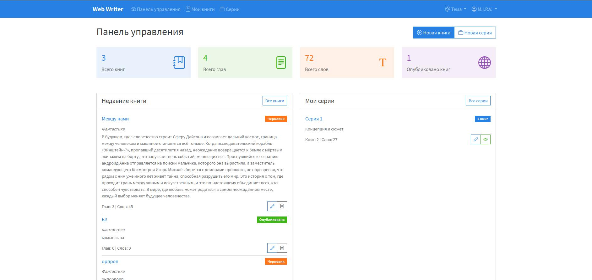
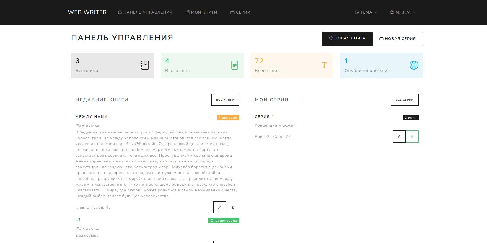
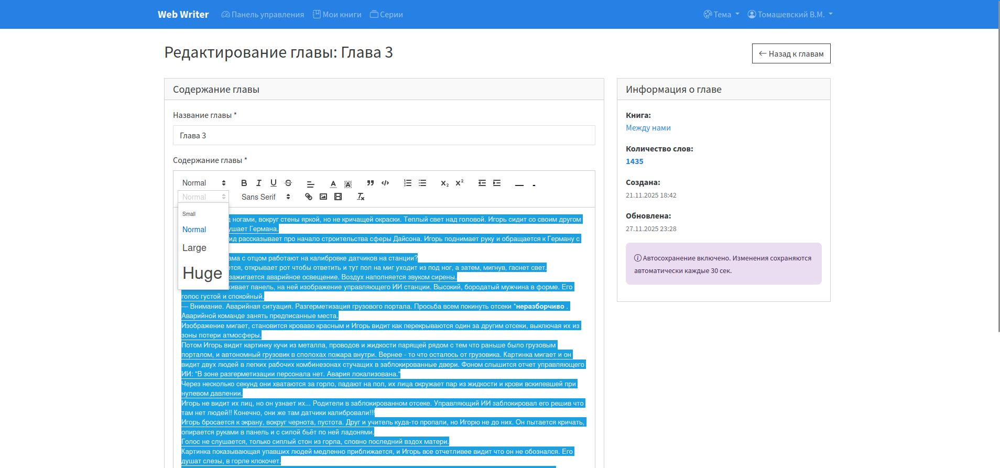
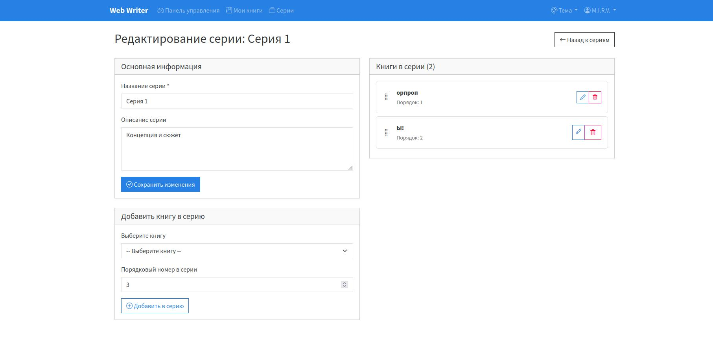
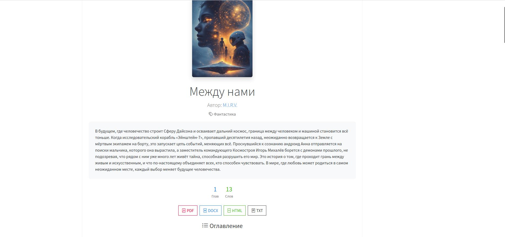

# Web Writer

**Лицензия:** AGPLv3  

**Web Writer** — веб-приложение для написания, хранения и публикации книг и серий книг. Поддерживает Markdown с расширением для диалогов, автосохранение текста, экспорт и управление пользователями.

---

## 🚀 Возможности

- **Книги и серии:** создавайте серии и добавляйте книги с главами.
- **Сортировка книг и глав:** сортируйте книги в сериях, и главы в книгах в том порядке в каком вам нравится.
- **Редактор книг:** 
  - WYSIWYG редактор Quill.js 
  - Автосохранение текста
  - Автоматическое форматирование книжных диалогов.
- **Темы оформления:** выберите в настройке тему которая вам больше по душе.
- **Предпросмотр книг:**
  - **Автор:** видит все черновики и опубликованные главы.  
  - **Публичный доступ:** только опубликованные главы по ссылке с `shared_token`.  
- **Обложки и аватары:** добавляйте изображения к книгам и профилям.  
- **Экспорт:** PDF, DOCX, HTML, TXT.  
- **Интерактивное содержание** в просмотре и экспорте книг
- **Администрирование пользователей:**  
  - Управление аккаунтами, активация/деактивация.  
  - При удалении пользователя удаляются все его книги.  

- **Публичные ссылки:** 
  - Делитесь книгой по `shared_token`. Хотите чтобы её никто больше не увидел? Перегенерируйте токен!
  - Давайте ссылку на свою страницу автора, где будет список опубликованных вами книг.

---

## ✨ Скриншоты
**Панель управления и смена темы**

<a href="assets/images/screens/5.jpg" target="_blank"></a>
<a href="assets/images/screens/3.jpg" target="_blank"></a>
<a href="assets/images/screens/2.jpg" target="_blank"></a>

**Редактор текста**

<a href="assets/images/screens/10.jpg" target="_blank"></a>

**Управление главами книги**

<a href="assets/images/screens/9.jpg" target="_blank"></a>

**Управление сериями книг**

<a href="assets/images/screens/6.jpg" target="_blank"></a>

**Просмотр книги**

<a href="assets/images/screens/11.jpg" target="_blank"></a>
---

## ⚙️ Требования

- **PHP:** 8.0 и выше  
- **MySQL** с InnoDB и внешними ключами  
- **PHP расширения:** `mbstring`, `json`, `PDO`  
- Веб-сервер с правами на запись в папки `config/` и `uploads/`  

> Composer не нужен. Все библиотеки уже включены в `vendor/`. 

---

## 📁 Структура проекта

```
web_writer/
├── controllers/          # Контроллеры приложения
│   ├── AuthController.php
│   ├── BookController.php
│   ├── ChapterController.php
│   └── ...
├── models/              # Модели данных
│   ├── User.php
│   ├── Book.php
│   ├── Chapter.php
│   └── ...
├── views/               # Шаблоны представлений
├── assets/              # Статические файлы
│   ├── css/
│   ├── js/
│   └── bs               # Темы для Bootstrap
├── uploads/             # Загружаемые файлы
│   ├── covers/          # Обложки книг
│   └── avatars/         # Аватары пользователей
├── vendor/              # Внешние библиотеки
├── config/              # Конфигурационные файлы
└── index.php           # Точка входа
```

## 🛠 Установка

1. Скопируйте файлы на веб-сервер или склонируйте репозиторий.
2. Проверьте доступность папок `config/` и `uploads/` для записи.  
3. Перейдите в браузере на `install.php` и следуйте шагам:  

   **Шаг 1: Настройки базы данных**  
   - Хост БД  
   - Имя базы данных  
   - Пользователь и пароль  

   **Шаг 2: Создание администратора**  
   - Имя пользователя  
   - Пароль  
   - Email (по желанию)  
   - Отображаемое имя (по желанию)

4. После успешной установки файл `config/config.php` будет сгенерирован автоматически.  
5. Перейдите на главную страницу приложения (`index.php`) и войдите под админом.
6. **Не забудьте удалить или переместить файл install.php!!!** (не обязательно, но желательно)

---

## 📝 Конфигурация

Файл `config/config.php` содержит:

- Подключение к базе данных: `DB_HOST`, `DB_USER`, `DB_PASS`, `DB_NAME`  
- Константы для системных путей
- Адрес сайта: `SITE_URL`  
- Имя приложения: `APP_NAME` = "Web Writer"

---

## 🛠 Дальнейшее развитие

- Возможно, добавится поддержка комментариев для публичных книг и рейтинг. Но это не точно :)

---

## ❗ Поддержка

Все ошибки и предложения шлите в issue

---

## 📜 Лицензия

Приложение распространяется под лицензией [AGPLv3](https://www.gnu.org/licenses/agpl-3.0.html).


